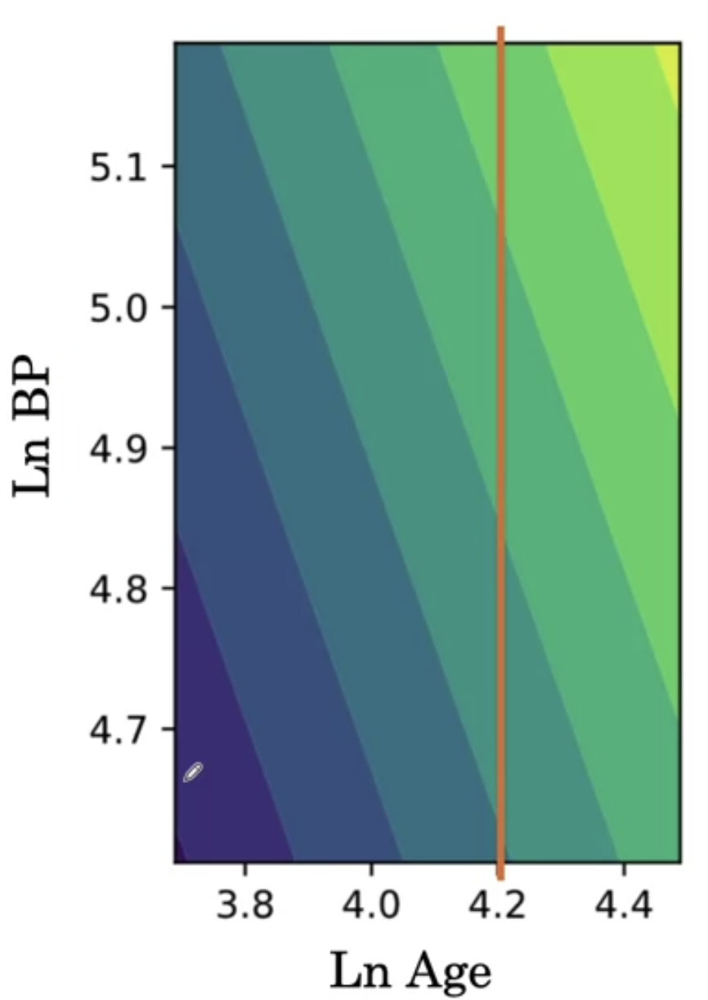
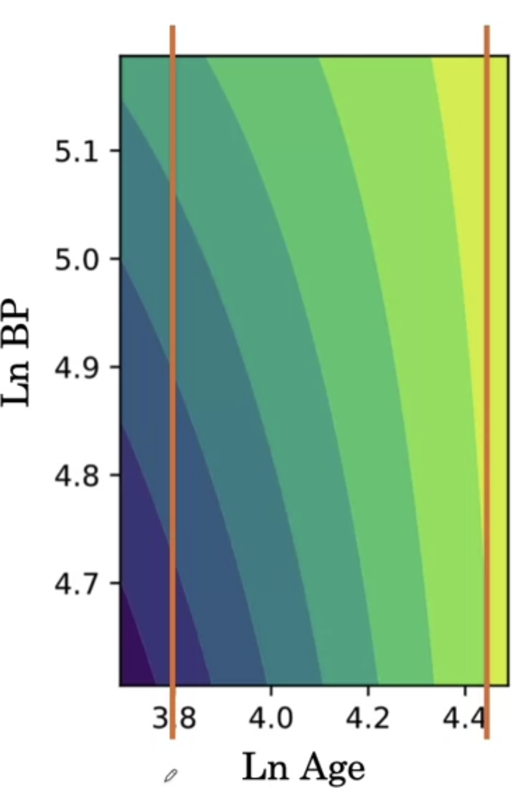

# AI for Medical Diagnosis

## Module 01

### Define Prognosis

Prognosis: A medical term that refers to predicting the risk of a failure event. Events can include outcomes such as death, heart failure, or a stroke. 

Prognosis is useful for informing patients, their risk of developing illness and useful for prediction of survival time with a illness. It is also useful for guiding treatment.

### Prognostic Models in Practice

A prognosis model can take input the patient profile which may include the clinical history, physical examination, labs and imaging.  
It output the risk scores, which can be arbitrary numbers or probabilities.

Eg: Atrial Fibrillation, a risk calculator $CHA_2DS_2-VASc$ (chads vasc) which predicts 1-year risk of stroke.

### Representing Feature Interaction

Risk Equation:

$$
score = (co\_eff)_A * A + (co\_eff)_B * ln(B) + ... + (co\_eff)_{KL} * ln(K) * L + ... + log(co\_eff)_M * M + (co\_eff)_N * N
$$

The risk equation doesn't need to be linear in the features themselves, it can be linear in $ln$ or $log$ of the features. Risk equation can also include interatction term like $KL$ above.

Effect of Interaction terms:

Without interaction terms, two features when added and plotted on a graph, we can say that when one feature is fixed, and the other feature is increased in the value, the overall score increases (score: Yellow > Green > Blue), irrespective of where we fixed the value in the first feature.

    

